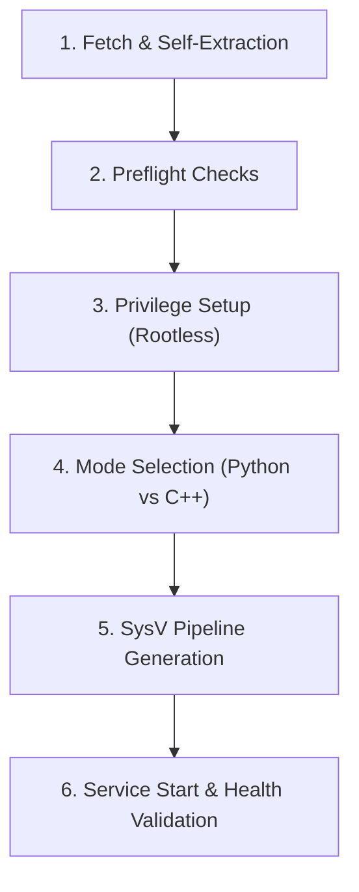

> **Ports are deployment-specific:** always pass the complete Hub ingest URL;
> the installer does not assume an ingest or bootstrap port.

# oldkernel/ — NetworkTracing Kit for CentOS 6.x / Kernel 2.6.32

Passive HTTP/SOAP capture kit designed for legacy enterprise nodes that **cannot run modern eBPF tools** (no eBPF, no systemd, Python 2.6 stdlib only).

```
Target Environment : CentOS 6.x / Linux kernel 2.6.32-xxx.el6 (supports 2.6.27+)
Language Runtime   : Python 2.6 stdlib only (zero pip dependencies) OR Native C++03
Privilege Model    : Rootless via file capabilities (cap_net_raw+ep); fail-closed, no root fallback
Impact             : 100% passive packet capture; zero application code changes; no kernel modules
```

---

## Table of Contents
1. [Architecture](#architecture)
2. [One-Line Installation (How It Works)](#one-line-installation-how-it-works)
3. [Script & Component Reference](#script--component-reference)
4. [Step-by-Step Usage Guide](#step-by-step-usage-guide)
   - [0. Standalone Prerequisite Smoke Test](#0-standalone-prerequisite-smoke-test)
   - [1. Non-Destructive Preflight Check](#1-non-destructive-preflight-check)
   - [2. Production Installation](#2-production-installation)
   - [3. Native C++ Mode Installation](#3-native-c-mode-installation)
   - [4. Verification & Live Event Proof](#4-verification--live-event-proof)
   - [5. Clean Uninstallation](#5-clean-uninstallation)
5. [Operational Notes & Hardening](#operational-notes--hardening)

For the complete parameter reference and operator runbook, see
[`RUNNING.md`](RUNNING.md). For controlled fleet rollout, see
[`ANSIBLE.md`](ANSIBLE.md).

The normal bare-host install is one command:

```sh
curl -sSf http://10.0.0.10:41000/oldkernel/install-firstrun-el68.sh -o install-firstrun-el68.sh && sudo sh install-firstrun-el68.sh --server http://10.0.0.10:42000
```

The two ports above are examples. Supply the deployment's actual independent
artifact-server and Hub-ingest URLs.

Optional settings remain flags on that command, for example
`--mode cpp --iface eth0 --ports 80,8001 --wsse-bytes 16384 --cpu 2`.

---

## Architecture

```
                      LEGACY NODE (CentOS 6.x / Kernel 2.6.32)
 ┌─────────────────────────────────────────────────────────────────────────┐
 │                                                                         │
 │   wire ──► AF_PACKET RAW socket (htons(0x0800))                         │
 │              │                                                          │
 │              │  ◄── Classic BPF (cBPF in kernel: filters IPv4 TCP      │
 │              │      destined to/from target ports; noise dropped)       │
 │              ▼                                                          │
 │        nt-sniff.py / nt-sniff-cpp                                       │
 │        · Per-flow TCP reassembly (8k flows, 5-min TTL, 256KB header cap)│
 │        · Fast HTTP/1.x request header parser & \r\n\r\n framing         │
 │        · Basic-auth user extraction (never extracts/emits passwords)    │
 │        · Optional bounded WSSE UsernameToken username extraction         │
│        · Strict fixed 4 MiB TPACKET_V2 RX ring in native mode            │
│        · One capture worker; PACKET_FANOUT is not used                    │
 │        · Response head correlation (status code, duration_ms)           │
 │        · JSONL event stream ──── stdout                                 │
 │              │                                                          │
 │              ▼  (UNIX Pipe)                                             │
 │        nt-ship.py / nt-ship-cpp                                         │
 │        · Multi-threaded batching (≤400 events / 5 s flush interval)     │
 │        · POST {node, events[]} ──► Hub /api/ingest                      │
 │        · Bounded in-memory queue; drops safely while Hub is unavailable │
 │                                                                         │
 │  SysV Service: /etc/init.d/networktracing-legacy                        │
 │  (chkconfig on; sniffer runs as locked 'ntsniff' user; shipper drops)   │
 └────────────────────────────────────┬────────────────────────────────────┘
                                      │ HTTP POST (plain JSON)
                                      ▼
                        NETWORKTRACING HUB (configured URL)
                    /api/ingest ──► Dashboard / Users / Violations
                    (Events tagged source_probe="pcap-http" or "pcap-http-cpp")
```

### Event Contract Schema (Identical to Modern eBPF Agent)

```json
{
  "ts": 1787793510,
  "host": "sale-node01",
  "src": "pcap",
  "service": "port:8010",
  "method": "POST",
  "path": "/SALE_SERVICE/bpm/sale/createOrder",
  "user": "vtp_app",
  "scheme": "basic",
  "caller": "10.207.58.79",
  "caller_port": 39687,
  "dst_ip": "10.240.147.249",
  "dst_port": 8010,
  "status": 200,
  "duration_ms": 14,
  "req_bytes": 482,
  "resp_bytes": 1024,
  "user_agent": "ReactorNetty/1.0.19",
  "x_forwarded_for": "10.0.0.1",
  "traceparent": "00-ad0d1a24079a814bc0fac5090bdb538b-720eb770ce5a4487-01",
  "trace_id": "ad0d1a24079a814bc0fac5090bdb538b",
  "source_probe": "pcap-http"
}
```

---

## One-Line Installation (How It Works)

### The Command
```sh
curl -sSf http://10.0.0.10:41000/oldkernel/install-firstrun-el68.sh -o install-firstrun-el68.sh && sudo sh install-firstrun-el68.sh --server http://10.0.0.10:42000
```

### What Happens Under the Hood (Step-by-Step)



1. **Self-Extraction & Kit Resolution**:
   - `install-firstrun-el68.sh` is a single self-contained script generated by `build-firstrun.sh`.
   - It checks if kit files already exist locally. If not, it automatically unpackages the embedded Base64 payload (`nt-sniff.py`, `nt-ship.py`, `nt-sniff-cpp.cpp`, `nt-ship-cpp.cpp`, `Makefile`, `nt-run-cpp.sh`, `nt-resource-guard.sh`, `nt-supervise.sh`) into `/tmp/ntkit`.
   - If the embedded payload is absent, it downloads fresh files only from the explicitly supplied `--kit-url`; no bootstrap port is inferred.

2. **Preflight Environment & Hub Reachability Probes**:
   - Validates Linux OS and kernel version (`2.6.32+`).
   - Confirms Python 2.6/2.7 standard library availability.
   - Probes the Hub `/api/ingest` endpoint with an empty handshake payload (`{"node":"legacy-compat-probe","events":[]}`).
   - Auto-detects the default network interface via `/proc/net/route` (e.g., `eth0`).

3. **Rootless Privilege Model (`cap_net_raw`)**:
   - Creates a dedicated locked system user `ntsniff` with no login shell (`/sbin/nologin`).
   - Copies `/usr/bin/python` to `/opt/networktracing-legacy/python-capnetraw`.
   - **Crucial Order**: Changes file ownership to `ntsniff` **first**, and then attaches file capability `cap_net_raw+ep` via `setcap` (because `chown` strips POSIX file capabilities on Linux).
   - *Fail-Closed Privilege Check*: If SELinux or the filesystem blocks file
     capabilities—or an `AF_PACKET` probe as `ntsniff` fails—the installer
     aborts. It never runs the sniffer as root.

4. **Engine Compilation (C++ Mode only)**:
   - When `--mode cpp` is specified, the installer auto-detects GCC compiler dialect (`-std=gnu++98` on GCC 4.4, `-std=gnu++03` on GCC 4.7+) and compiles `nt-sniff-cpp` and `nt-ship-cpp` with `-O2`.

5. **SysV Pipeline Assembly**:
   - Writes the SysV init script `/etc/init.d/networktracing-legacy` with runlevel definitions (`chkconfig: 2345 90 10`).
   - Chains the capture process directly into the shipper via a UNIX pipe:
     ```sh
     su -s /bin/sh ntsniff -c 'exec python-capnetraw nt-sniff.py ...' | exec python nt-ship.py --endpoint ...
     ```
   - Uses bounded in-memory shipping queues. Events are dropped safely during an outage rather than growing memory or disk without limit.

6. **Service Start & Health Assertion**:
   - Enables the service via `chkconfig networktracing-legacy on`.
   - Starts the service and actively verifies that the sniffer and shipper process PIDs exist before exiting with code 0.

---

## Script & Component Reference

| File | Type | Purpose & Description |
|---|---|---|
| [`install-oldkernel.sh`](install-oldkernel.sh) | Shell Script | Modular SysV installer supporting `--check`, standard install, and `--uninstall`. |
| [`install-firstrun-el68.sh`](install-firstrun-el68.sh) | Shell Script | Standalone single-file bundle with embedded Base64 payloads for direct curl execution. |
| [`build-firstrun.sh`](build-firstrun.sh) | Shell Script | Generator script that packs current kit files into `install-firstrun-el68.sh`. |
| [`RUNNING.md`](RUNNING.md) | Markdown | Complete installation, parameter, lifecycle, verification, and troubleshooting guide. |
| [`ANSIBLE.md`](ANSIBLE.md) | Markdown | Checksum-controlled, rolling, offline fleet deployment with Ansible. |
| [`nt-resource-guard.sh`](nt-resource-guard.sh) | POSIX Shell | Fail-closed CPU affinity, scheduling, memory, process, descriptor, and file limits. |
| [`nt-supervise.sh`](nt-supervise.sh) | POSIX Shell | Bounded abnormal-exit recovery with exponential backoff and crash-loop circuit breaker. |
| [`el68-smoke.sh`](el68-smoke.sh) | Shell Script | 6-point prerequisite smoke test (Kernel, Python, `setcap`, `AF_PACKET`, SELinux, py_compile). |
| [`nt-sniff.py`](nt-sniff.py) | Python 2.6 | Python `AF_PACKET` sniffer with classic BPF filter, TCP reassembly, and Basic auth parser. |
| [`nt-ship.py`](nt-ship.py) | Python 2.6 | Multithreaded HTTP event shipper with a bounded in-memory queue (`Queue`, `urllib2`). |
| [`nt-sniff-cpp.cpp`](nt-sniff-cpp.cpp) | C++03 | High-performance C++03 replacement sniffer with socket BPF and flow tracking. |
| [`nt-ship-cpp.cpp`](nt-ship-cpp.cpp) | C++03 | Compatibility native shipper with a socket HTTP client and bounded in-memory queue. |
| [`Makefile`](Makefile) | Makefile | Builds C++ binaries with GCC 4.4 / 4.7+ auto-detection (`make all`, `make fixture`). |
| [`CENTOS-6.7-TEST.md`](CENTOS-6.7-TEST.md) | Markdown | 13-gate full verification runbook for real CentOS 6.x / Linux 2.6.32 nodes. |
| [`verify-centos-runbook.sh`](verify-centos-runbook.sh) | Shell Script | Static and local build verifier for runbook integrity. |

---

## Step-by-Step Usage Guide

Set the exact deployment-specific Hub URL before using the examples:

```sh
HUB_URL=http://hub.example:42000
```

### 0. Standalone Prerequisite Smoke Test
Run this first on any candidate node to verify kernel, Python, and file capability viability:
```sh
sudo sh el68-smoke.sh
```
*Expected Output:* `NT-SMOKE done: 6 pass, 0 fail`

### 1. Non-Destructive Preflight Check
Validates Hub connectivity, network interface, and dependencies without modifying system files:
```sh
sudo sh install-oldkernel.sh --check --server "$HUB_URL"
```

The installed process tree is fail-closed behind a rootless resource guard: it
can execute on only one logical CPU at nice 19 and inherits hard memory, stack,
locked-memory, descriptor, output-file, process, and core-dump limits. A
bounded supervisor restarts isolated failures with exponential backoff and
opens its circuit after five short crashes. The installer selects the first
CPU in its allowed cpuset; set `NT_CPU_CORE=N` to choose another allowed core.
`taskset`, `setcap`, and the dedicated non-login user are mandatory; the agent
will not fall back to running as root. Installation proves raw-socket access
under that account, and the running sniffer drops `CAP_NET_RAW` permanently
after its filtered packet socket is configured.

### 2. Production Installation (Python Mode)
Installs the standard Python 2.6 capture pipeline:
```sh
sudo NT_IFACE=eth0 NT_PORTS=80,8003,8005,8009,8010 \
  sh install-oldkernel.sh --server "$HUB_URL"
```

### 3. Native C++ Mode Installation
For high-throughput environments (>1,000 requests/sec), compile and run native C++ binaries:
```sh
sudo NT_CAPTURE_MODE=cpp NT_IFACE=eth0 NT_PORTS=80,8003,8005,8009,8010 \
  sh install-oldkernel.sh --server "$HUB_URL"
```

### 4. Verification & Live Event Proof
Check service status and logs:
```sh
service networktracing-legacy status
tail -f /opt/networktracing-legacy/sniff.log
tail -f /opt/networktracing-legacy/ship.log
```

Send a test request with Basic auth:
```sh
curl -sS -u testuser:secretpass http://127.0.0.1:8010/api/health
```

That curl only proves capture when the agent monitors `lo`. Linux routes a
host's request to its own non-loopback address through `lo` as well. Confirm
the actual path before testing an interface such as `eth0`:

```sh
TARGET_IP=10.0.0.35
ip route get "$TARGET_IP"
```

If it reports `local ... dev lo`, generate traffic from another host. For a
fully local and deterministic fallback, create a temporary network namespace
and veth pair, bind the agent to the host veth endpoint, and send the request
from the namespace. This exercises non-loopback ingress without changing the
application; remove the namespace and host veth after the test.

Query the Hub to verify receipt:
```sh
curl -fsS "$HUB_URL/api/events?limit=10&q=testuser"
```
*(Confirmed: Username `testuser` is extracted; password `secretpass` is never logged or transmitted).*

### 5. Clean Uninstallation
To cleanly remove the service, PID files, and all installed binaries:
```sh
sudo sh install-oldkernel.sh --uninstall
```
*Guarantees zero process residue, deletes `/opt/networktracing-legacy` and `/etc/init.d/networktracing-legacy`.*

---

## Operational Notes & Hardening

- **WSSE is explicitly opt-in:** The default `0` byte
  window is strictly header-only. To inspect the beginning of XML/SOAP bodies,
  install with `NT_WSSE_BODY_BYTES=16384` or
  `--wsse-body-bytes 16384`. Accepted values are `0..65536`. Only OASIS 2004
  and legacy 2002/07, 2002/12, and 2003/06 namespaced `UsernameToken/Username`
  values are emitted as `user` with `scheme=wsse`; bodies, passwords/digests,
  nonces, and timestamps are discarded. Body buffering is additionally capped
  at 256 concurrent flows (16 MiB at the maximum window). Requests need an XML
  content type and `Content-Length`; chunked SOAP bodies remain anonymous.
- **Python/C++03 parity:** Both capture modes enforce the same bounded WSSE
  body window, namespace allowlist, `Content-Length` requirement, concurrent
  flow ceiling, and secret-scrubbing contract.
- **Network Outage Resilience:** Shipping queues are bounded in memory. When
  the Hub is unreachable, excess events are dropped instead of creating
  unbounded memory or disk growth; delivery resumes when the Hub returns.
- **Memory & Flow Bounds:** The in-memory TCP flow table is hard-capped at 8,192 concurrent flows with a 300-second TTL sweep.
- **Reconfiguring Monitored Ports:** To monitor new ports, re-run the installer with the updated `NT_PORTS` list:
  ```sh
  sudo NT_PORTS=80,8010,8080 sh install-oldkernel.sh --server "$HUB_URL"
  ```
- **Response-loss fallback:** A request is retained for response enrichment,
  but is emitted after five seconds if the response is filtered or split.
  Stop/restart also drains all retained requests before closing the shipper.
- **Updating the Bundle:** After making changes to any `.py` or `.cpp` source files, rebuild the self-contained installer bundle:
  ```sh
  sh build-firstrun.sh
  ```
